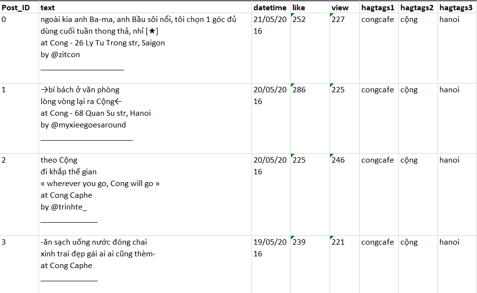

# Social-Data-Scraping
Use Selenium Webdriver and tools for efficient data extraction from social media platform (Instagram, Youtube)
# Social Media Scraper for Vietnamese Coffee Brands

## Project Overview
This repository contains a Selenium WebDriver based tool designed to automate the scraping of social media posts and videos from major Vietnamese coffee brands. The tool navigates through social media pages, automatically collects data, and processes it for further analysis.

## Responsibilities
### Data Collection
- **Automation**: Utilizes Selenium WebDriver to simulate repetitive web browsing actions to load and collect data from posts.
- **Data Scraping**: Collects a variety of data from each post, including:
  - Post timestamp
  - Interaction counts (likes, comments, shares)
  - Text content
  - Hashtags

### Data Processing
- **Text Processing**: Extracts all text information from posts, including titles and hashtags.
- **Timestamp Conversion**: Converts timestamp data to a standardized format.
- **Error Handling**: Implements strategies to handle common scraping errors such as data loss and duplication.

## Achievements
- **Volume of Data**: Successfully gathered over 1000 posts from multiple Vietnamese coffee brands, enriching our dataset for strategic marketing analysis.
- **Data Insight**: Processed and stored data effectively, allowing for the analysis of social media strategies across different brands.

## Example Data Visualization
The following image shows a sample of the scraped data from Café Cộng in Vietnam:

## Usage
1. Clone the repository to your local machine.
2. Ensure you have Selenium WebDriver set up with the required browser drivers.
3. Run the script to start scraping data from specified social media pages.

## Dependencies
- Selenium WebDriver
- Python 3.x
- Any other libraries or frameworks used in the project
